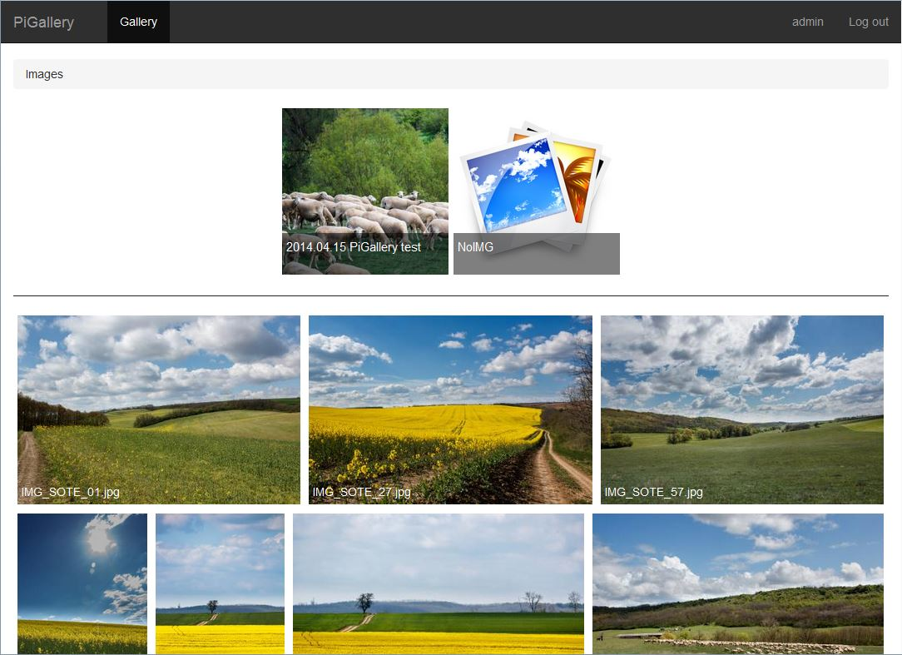

PiGallery 0.91
=========

This is a lightweight online photo gallery design for Raspberry Pi, but can be used with any other device.
The aim of the project to create a photo gallery that is optimised for low resource servers, but have a rich client side.

Features:
--------

* The site has 2 modes: Database(Mysql) mode and a database less mode.
* authentication
* * Support for no-authentication/Guest mode at local netwrok
* recursive directory scan
* on the fly thumbnail generation with cache
* on the fly direcotry indexing (for database mode)
* nice lightbox for image perview (using blueimp* gallery)
* supports image keywords (like lightroom keywords)
* search in file names, directory names, keywords(database mode only)
* designed for low* resource serves (weak CPU, low bandwidth)

Installation:
--------

*  Install php, and a webserver(apache, nginx) on your device and a (optional) database server (mysql, mariadb)
*  download the latest [release (v0.90)](release/pigallery_0.90.zip) from github, extract  it in your www directory (or in a subdirectory)
*  open config.php and edit the configurations according to the comments.
*  if your using database mode, be sure the the database, you set in the config.php is exist
*  login with user: admin, pass: admin (or whatever you set in config.php)
*  in database mode, click on admin panel and click index photos,
   or enable on the fly indexing in the config.php (but in this case the manual indexing still recommended at the admin panel)

Notes:
--------

* site is using mysqli for accessing database. It should be enabled in php.ini
* for best performance don't store much photos in a directory (best is under 200-300)
* at large directories php timeout may occur, in this case increase the timeout in php.ini
* for faster thumbnail generating user less thumbnail sizes (eg.: only one, with a low value, eg.: 150)
  and disable image resampling in config.php

ScreenShot:
--------

